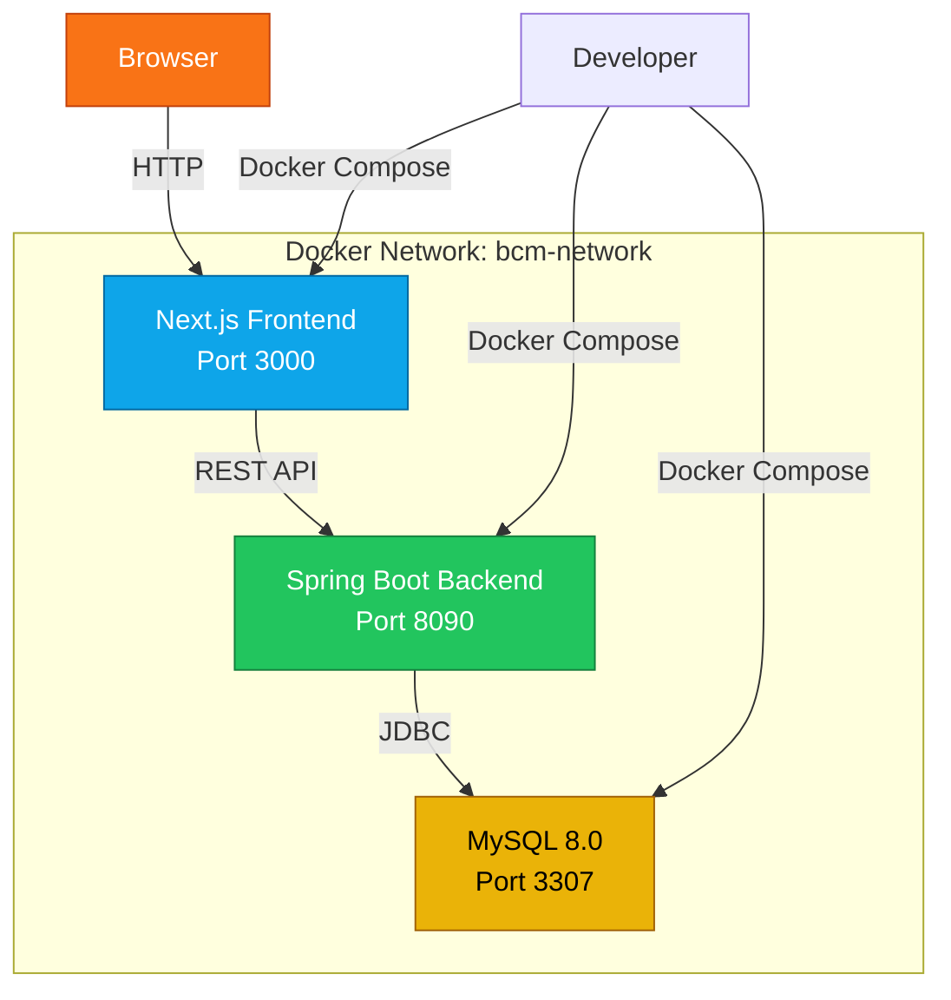

# 🐳 BCM v2.0 - Docker Orchestration

> Complete Docker Compose setup for running the Business Contracts Manager full-stack application

[](https://spring.io/)
[](https://nextjs.org/)
[](https://www.mysql.com/)
[](https://www.docker.com/)
[](./LICENSE)

---

## 🎯 Overview

This repository contains the **Docker Compose configuration** for running the complete BCM v2.0 stack with a single command. Perfect for development, testing, and demonstration purposes.

**What it does:**
- 🗄️ Spins up MySQL 8.0 database with persistent storage
- 🔧 Builds and runs Spring Boot backend API
- 🎨 Builds and runs Next.js frontend application
- 🔗 Configures networking between all services
- 📊 Initializes database with schema and seed data

---

## 🏗️ Architecture



### Project Structure

```
bcm-v2/
├── bcm-v2-backend/        # Spring Boot REST API
│   ├── src/
│   ├── pom.xml
│   └── Dockerfile
├── bcm-v2-frontend/       # Next.js Web Application
│   ├── app/
│   ├── components/
│   ├── package.json
│   └── Dockerfile
└── bcm-v2-docker/         # 👉 This repository
    ├── docker-compose.yml
    ├── .env               # Your credentials (git-ignored)
    └── .env.example       # Template file
```

---

## 📦 Services

| Service | Container Name | Port | Technology | Description |
|---------|----------------|------|------------|-------------|
| **MySQL** | `bcm-mysql` | `3307` | MySQL 8.0 | Database server with persistent volume |
| **Backend** | `bcm-backend` | `8090` | Spring Boot 3.5 + Java 21 | REST API with JWT authentication |
| **Frontend** | `bcm-frontend` | `3000` | Next.js 16 + React 19 | Web UI with Tailwind CSS |

**Network:** All services communicate via `bcm-network` (bridge driver)

---

## 🚀 Quick Start

### Prerequisites

Ensure you have installed:
- ✅ [Docker Desktop](https://www.docker.com/products/docker-desktop) (Windows/Mac) or Docker Engine (Linux)
- ✅ [Docker Compose](https://docs.docker.com/compose/install/) (usually included with Docker Desktop)
- ✅ [Git](https://git-scm.com/downloads)
- ✅ Minimum 4GB RAM available for Docker
- ✅ 10GB free disk space

**Verify installation:**

```bash
docker --version          # Should show: Docker version 20.10+
docker-compose --version  # Should show: Docker Compose version 2.0+
```

---

### Step 1: Clone All Repositories

**Option A: Clone into a single parent directory (recommended)**

```bash
# Create project directory
mkdir bcm-v2 && cd bcm-v2

# Clone all three repositories
git clone https://github.com/DonatoCorbacioDev/bcm-v2-backend.git
git clone https://github.com/DonatoCorbacioDev/bcm-v2-frontend.git
git clone https://github.com/DonatoCorbacioDev/bcm-v2-docker.git

# Your structure should now be:
# bcm-v2/
#   ├── bcm-v2-backend/
#   ├── bcm-v2-frontend/
#   └── bcm-v2-docker/

cd bcm-v2-docker
```

**Option B: Clone separately (adjust paths in docker-compose.yml)**

If you clone repositories in different locations, update the `context` paths in `docker-compose.yml`:

```yaml
backend:
  build:
    context: /path/to/your/bcm-v2-backend  # Update this
    
frontend:
  build:
    context: /path/to/your/bcm-v2-frontend  # Update this
```

---

### Step 2: Configure Environment Variables

**Create your `.env` file from the template:**

```bash
# Copy the example file
cp .env.example .env

# Edit with your credentials (Windows)
notepad .env

# Edit with your credentials (Linux/Mac)
nano .env
# or
vim .env
```

**Minimum required configuration:**

```env
# Database
DB_ROOT_PASSWORD=your_secure_password_here
DB_USERNAME=bcm_user
DB_PASSWORD=your_db_password_here

# JWT (generate with: openssl rand -base64 64)
JWT_SECRET=your_base64_encoded_secret_here

# Email (optional - for password reset)
MAIL_HOST=smtp.gmail.com
MAIL_PORT=587
MAIL_USERNAME=your-email@gmail.com
MAIL_PASSWORD=your-gmail-app-password
```

**⚠️ IMPORTANT:** 
- Generate a **strong JWT secret** (minimum 256 bits)
- Use **complex passwords** (16+ characters)
- **NEVER** commit `.env` to Git

---

### Step 3: Start All Services

```bash
# Build and start all containers (first time: 5-10 minutes)
docker-compose up -d

# View logs in real-time
docker-compose logs -f

# Or view logs for specific service
docker-compose logs -f backend
docker-compose logs -f frontend
docker-compose logs -f mysql
```

**What happens during startup:**

1. 🗄️ MySQL container starts and creates database
2. 📊 SQL initialization scripts run (DDL + DML)
3. 🔧 Backend builds with Maven and starts Spring Boot
4. 🎨 Frontend builds with npm and starts Next.js
5. ✅ All services become healthy

**Expected build time:**
- First build: 5-10 minutes (downloads dependencies)
- Subsequent builds: 1-2 minutes (uses cache)

---

### Step 4: Verify Services

**Check all containers are running:**

```bash
docker-compose ps
```

**Expected output:**

```
NAME            STATUS      PORTS
bcm-mysql       Up          0.0.0.0:3307->3306/tcp
bcm-backend     Up          0.0.0.0:8090->8090/tcp
bcm-frontend    Up          0.0.0.0:3000->3000/tcp
```

**Health checks:**

```bash
# Backend API health
curl http://localhost:8090/api/v1/actuator/health

# Frontend (should return HTML)
curl http://localhost:3000

# MySQL (from host)
mysql -h 127.0.0.1 -P 3307 -u bcm_user -p
```

---

### Step 5: Access the Application

Once all services are running:

| Service | URL | Description |
|---------|-----|-------------|
| 🌐 **Frontend** | [http://localhost:3000](http://localhost:3000) | Web application login page |
| 🔌 **Backend API** | [http://localhost:8090/api/v1](http://localhost:8090/api/v1) | REST API base URL |
| 📚 **Swagger UI** | [http://localhost:8090/api/v1/swagger-ui.html](http://localhost:8090/api/v1/swagger-ui.html) | Interactive API documentation |
| 🩺 **Health Check** | [http://localhost:8090/api/v1/actuator/health](http://localhost:8090/api/v1/actuator/health) | Backend health status |
| 🗄️ **MySQL** | `localhost:3307` | Connect with MySQL Workbench or CLI |

---

## 🎮 Common Commands

### Container Management

```bash
# Start all services
docker-compose up -d

# Stop all services (keeps data)
docker-compose down

# Stop and remove all data (fresh start)
docker-compose down -v

# Restart a specific service
docker-compose restart backend
docker-compose restart frontend

# Rebuild after code changes
docker-compose up -d --build

# Rebuild specific service
docker-compose up -d --build backend
```

### Viewing Logs

```bash
# All logs (real-time)
docker-compose logs -f

# Last 100 lines from backend
docker-compose logs --tail=100 backend

# Follow only errors
docker-compose logs -f | grep ERROR

# Export logs to file
docker-compose logs > logs.txt
```

### Database Operations

```bash
# Connect to MySQL CLI
docker exec -it bcm-mysql mysql -uroot -p

# Backup database
docker exec bcm-mysql mysqldump -uroot -p bcm > backup.sql

# Restore database
docker exec -i bcm-mysql mysql -uroot -p bcm < backup.sql

# View database size
docker exec bcm-mysql mysql -uroot -p -e "SELECT table_schema AS 'Database', ROUND(SUM(data_length + index_length) / 1024 / 1024, 2) AS 'Size (MB)' FROM information_schema.tables WHERE table_schema='bcm' GROUP BY table_schema;"
```

### Container Shell Access

```bash
# Access backend container shell
docker exec -it bcm-backend /bin/bash

# Access frontend container shell
docker exec -it bcm-frontend /bin/sh

# Access MySQL container shell
docker exec -it bcm-mysql /bin/bash
```

---

## 🐛 Troubleshooting

### Problem: Backend won't start

**Symptoms:**
- `bcm-backend` container exits immediately
- Logs show "Connection refused" or "Access denied"

**Solution:**

```bash
# 1. Check MySQL is running
docker-compose ps mysql

# 2. Verify MySQL is healthy (wait 30 seconds after start)
docker-compose logs mysql | grep "ready for connections"

# 3. Check environment variables
docker exec bcm-backend printenv | grep DB

# 4. Test MySQL connection from backend container
docker exec bcm-backend mysql -h bcm-mysql -u bcm_user -p

# 5. Restart backend after MySQL is ready
docker-compose restart backend
```

---

### Problem: Frontend can't connect to backend

**Symptoms:**
- Login fails with "Network Error"
- Frontend shows "Failed to fetch"

**Solution:**

```bash
# 1. Verify backend is accessible
curl http://localhost:8090/api/v1/actuator/health

# 2. Check frontend environment variable
docker exec bcm-frontend printenv | grep NEXT_PUBLIC_API_URL

# 3. Verify network connectivity
docker exec bcm-frontend ping bcm-backend

# 4. Check CORS configuration in backend
docker-compose logs backend | grep CORS

# 5. Restart frontend
docker-compose restart frontend
```

---

### Problem: Port already in use

**Symptoms:**
- `Error: bind: address already in use`

**Solution:**

```bash
# Windows: Find and kill process using port 3000/8090/3307
netstat -ano | findstr :3000
taskkill /PID <PID> /F

# Linux/Mac: Find and kill process
lsof -ti:3000 | xargs kill -9

# Or change ports in docker-compose.yml:
# ports:
#   - "3001:3000"  # Use 3001 instead of 3000
```

---

### Problem: Database schema not created

**Symptoms:**
- Backend logs: "Table 'bcm.users' doesn't exist"

**Solution:**

```bash
# 1. Check if init scripts ran
docker-compose logs mysql | grep "docker-entrypoint-initdb.d"

# 2. If not, restart with fresh volume
docker-compose down -v
docker-compose up -d

# 3. Or manually run DDL scripts
docker exec -i bcm-mysql mysql -uroot -p bcm < ../bcm-v2-backend/sql/DDL/bcm_schema.sql
```

---

### Problem: Changes not reflected after rebuild

**Symptoms:**
- Code changes don't appear after `docker-compose up --build`

**Solution:**

```bash
# Full rebuild without cache
docker-compose build --no-cache backend
docker-compose up -d

# Or remove everything and rebuild
docker-compose down -v --rmi all
docker-compose up -d --build
```

---

### Problem: Out of memory / containers crashing

**Symptoms:**
- Containers exit with code 137 or 143
- Docker Desktop shows high memory usage

**Solution:**

1. **Increase Docker memory limit:**
   - Docker Desktop → Settings → Resources → Memory → Set to 6GB+

2. **Limit container resources in docker-compose.yml:**

```yaml
backend:
  deploy:
    resources:
      limits:
        memory: 2G
      reservations:
        memory: 1G
```

3. **Clean up unused resources:**

```bash
# Remove unused images, containers, volumes
docker system prune -a --volumes

# Check disk usage
docker system df
```

---

### Problem: JWT token errors

**Symptoms:**
- Backend logs: "DecodingException: Illegal base64 character"
- Login returns 401 Unauthorized

**Solution:**

```bash
# 1. Verify JWT_SECRET is base64 encoded
docker exec bcm-backend printenv JWT_SECRET

# 2. Generate new valid key
openssl rand -base64 64

# 3. Update .env file with new key

# 4. Restart backend
docker-compose restart backend
```

---

## 🔧 Development Workflow

### Making Code Changes

**Backend changes:**

```bash
# 1. Edit code in bcm-v2-backend/src/...

# 2. Rebuild and restart backend
docker-compose up -d --build backend

# 3. View logs for errors
docker-compose logs -f backend
```

**Frontend changes:**

```bash
# 1. Edit code in bcm-v2-frontend/app/... or components/...

# 2. Rebuild and restart frontend
docker-compose up -d --build frontend

# 3. View logs
docker-compose logs -f frontend
```

**Hot reload alternative (faster development):**

For rapid development, run services locally instead of in Docker:

```bash
# Terminal 1: MySQL only in Docker
docker-compose up -d mysql

# Terminal 2: Backend locally
cd ../bcm-v2-backend
mvn spring-boot:run

# Terminal 3: Frontend locally
cd ../bcm-v2-frontend
npm run dev
```

---

## 🧹 Cleanup

### Remove containers but keep data

```bash
docker-compose down
```

### Remove containers AND all data (fresh start)

```bash
docker-compose down -v
```

### Remove everything including images

```bash
docker-compose down -v --rmi all
```

### Complete Docker cleanup (all projects)

```bash
# ⚠️ WARNING: This removes ALL Docker resources on your machine

# Stop all running containers
docker stop $(docker ps -aq)

# Remove all containers
docker rm $(docker ps -aq)

# Remove all images
docker rmi $(docker images -q)

# Remove all volumes
docker volume prune -a

# Remove all networks
docker network prune

# Clean build cache
docker builder prune -a
```

---

## 🔒 Security Notes

**For Development:**
- ✅ `.env` file is git-ignored (credentials safe)
- ✅ Default ports are non-standard (3307 instead of 3306)
- ✅ JWT secrets required
- ⚠️ Containers run as root (acceptable for local dev)

**Before Production Deployment:**

- [ ] Use Docker secrets instead of `.env`
- [ ] Run containers as non-root users
- [ ] Enable TLS/SSL for all connections
- [ ] Use private Docker registry
- [ ] Implement health checks and restart policies
- [ ] Set up proper logging and monitoring
- [ ] Use orchestration (Kubernetes, Docker Swarm)
- [ ] Implement rate limiting
- [ ] Set up automated backups
- [ ] Review and harden container images

---

## 📚 Additional Resources

### Related Repositories

- **Backend:** [bcm-v2-backend](https://github.com/DonatoCorbacioDev/bcm-v2-backend) - Spring Boot REST API with 100% test coverage
- **Frontend:** [bcm-v2-frontend](https://github.com/DonatoCorbacioDev/bcm-v2-frontend) - Next.js web application

### Documentation

- [Docker Compose Documentation](https://docs.docker.com/compose/)
- [Spring Boot Docker Guide](https://spring.io/guides/topicals/spring-boot-docker/)
- [Next.js Docker Deployment](https://nextjs.org/docs/deployment#docker-image)

---

## 👨‍💻 About

**Author:** Donato Corbacio  
**Email:** donatocorbacio92@gmail.com  
**LinkedIn:** [linkedin.com/in/donato-corbacio](https://www.linkedin.com/in/donato-corbacio/)  
**GitHub:** [@DonatoCorbacioDev](https://github.com/DonatoCorbacioDev)

---

## 📄 License

This project is licensed under a **Custom Non-Commercial License**.

- ✅ Available for educational and portfolio purposes
- ✅ Free to review and learn from
- ❌ Commercial use prohibited without permission

For commercial licensing: donatocorbacio92@gmail.com

---

## 🙏 Acknowledgments

Thanks to:
- Docker and Docker Compose teams
- Spring Boot and Next.js communities
- MySQL and open-source contributors

---

**⭐ If you're a recruiter or technical reviewer**, this Docker setup demonstrates:
- Production-ready containerization
- Multi-service orchestration
- Proper environment configuration
- Database initialization automation
- Network isolation and security

**💬 Questions?** Open an issue or reach out via email!
